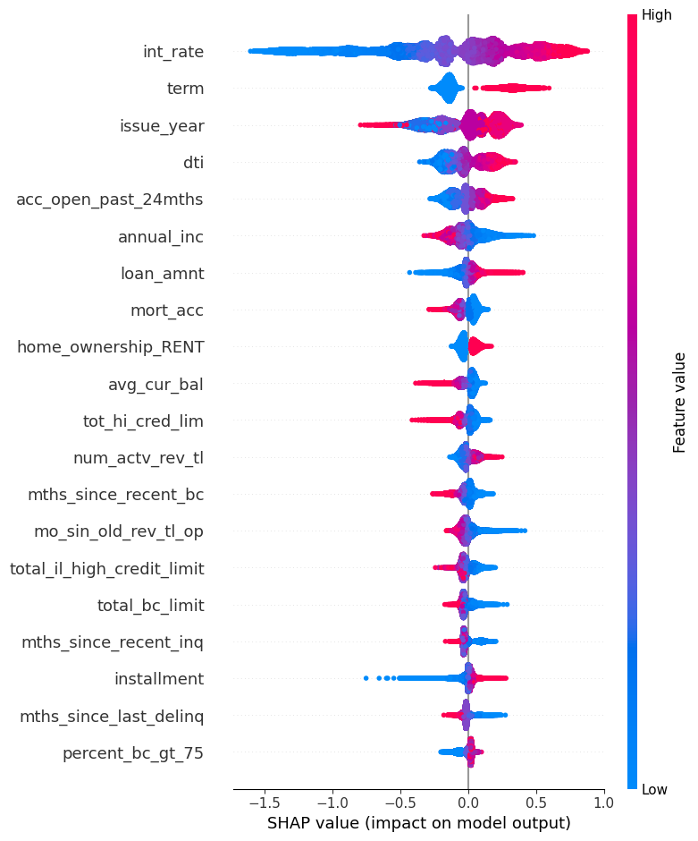
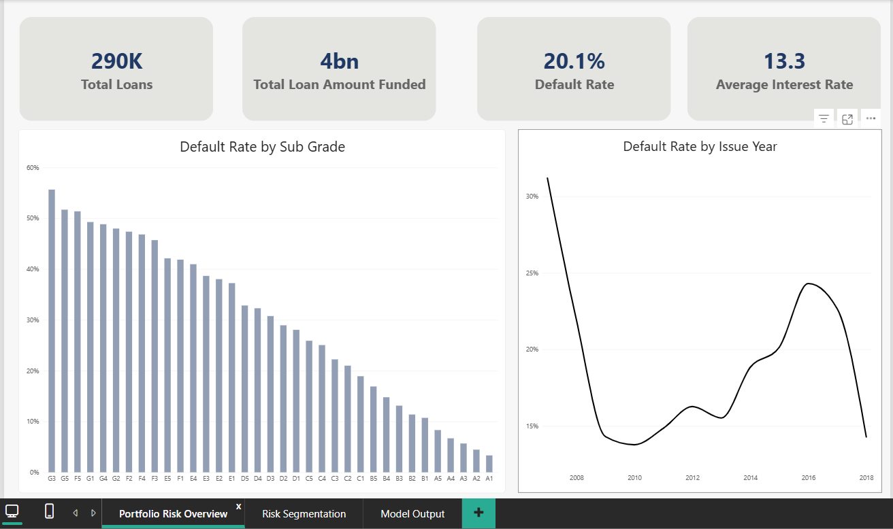
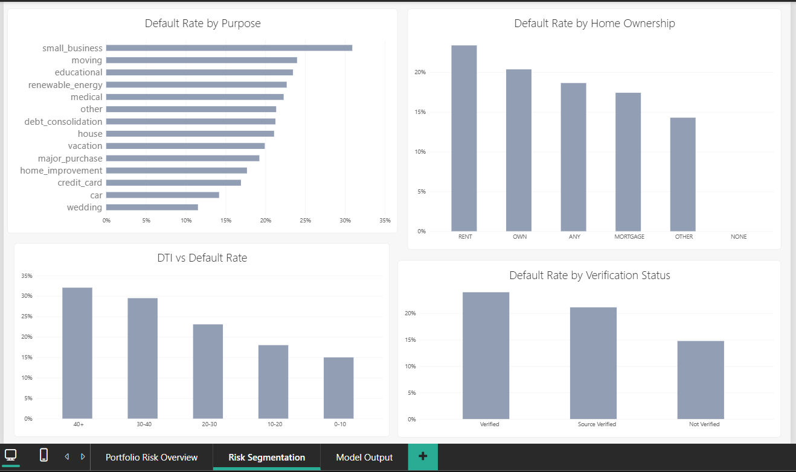
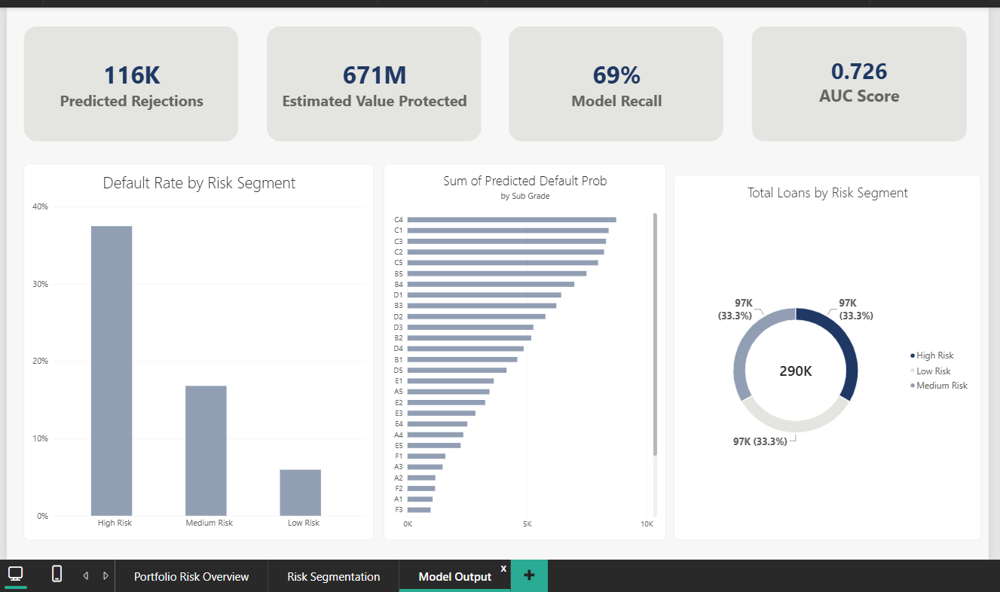

# Credit Risk Prediction & Portfolio Analysis — Lending Club

## Project Overview
Built a credit risk pipeline on 290K Lending Club loans — catching and fixing a data leakage issue via mutual information analysis, tuning an XGBoost classifier to AUC 0.73, and validating results with bootstrap CI and t-tests. Used SHAP for model interpretability, then converted predictions into a business decision using a cost-sensitive threshold analysis (corrected with real interest-margin data), surfaced in a 3-page Power BI dashboard for portfolio risk monitoring.

## Key Findings

- **Caught and fixed data leakage**: the top feature's mutual information score dropped from 0.47 to 0.04 once post-outcome columns (fields only known after a loan's fate is decided) were removed — the "before" model was learning the answer, not predicting it.
- **Tuned XGBoost reached AUC 0.7265** (baseline: 0.7177), with the improvement confirmed via bootstrap confidence interval [0.7127, 0.7226].
- **Statistically validated key risk drivers** using t-tests (p < 0.001), so the drivers reported aren't just high on a feature-importance chart — they hold up under a formal test.
- **Cost-sensitive threshold analysis**: an initial assumption of 10% cost-per-default was replaced with the real interest-margin figure (27.2%), which shifted the optimal decision threshold from 0.25 to 0.50 — a concrete example of how a wrong cost assumption changes the actual lending decision, not just a metric.

## Tech Stack

Python (pandas, numpy, XGBoost, scikit-learn, SHAP), Power BI, DAX

## Pipeline

### 1. Data Cleaning & Preparation
- Filtered ~2.26M raw loan records down to 1.3M resolved loans (Fully Paid / 
  Charged Off only — in-progress loans like "Current" or "Late" don't yet have 
  a known outcome and can't be used as training labels)
- Stratified sample of 290K rows, preserving the original ~80/20 class balance
- **Outlier handling**: IQR-based detection on `annual_inc`, `dti`, and 
  `loan_amnt` (14,049 / 1,045 / 1,471 flagged respectively). `annual_inc` was 
  capped at the 99th percentile — extreme income values add distributional 
  noise without proportionally more risk signal. `dti` and `loan_amnt` outliers 
  were left unmodified — for `dti` specifically, very high values are 
  themselves a meaningful risk signal, and capping would suppress exactly the 
  cases the model most needs to learn from
- Dropped columns >60% missing; imputed remaining gaps with median (numeric) 
  or explicit bucketing (categorical)
- **Feature engineering**: converted `term`, `emp_length` from text to numeric; 
  derived `issue_year` and `credit_history_years` from raw date fields
- Bucketed rare categories (e.g., `purpose` values under 1% of the data) into 
  "Other" to avoid sparse one-hot columns; one-hot encoded the final 
  categorical set (`sub_grade`, `home_ownership`, `verification_status`, `purpose`)
  
### 2. Leakage Detection & Removal

**The problem:** a first pass at feature relevance (mutual information against 
the target) showed one feature, `total_rec_prncp`, scoring 0.47 — more than 
10x higher than any other feature. That kind of outlier score is a red flag, 
not a good sign: it usually means the model has access to information it 
shouldn't.

**The investigation:** `total_rec_prncp` (total principal received) and several 
related columns — payment history (`total_pymnt`, `last_pymnt_amnt`), 
post-default fields (`recoveries`, `collection_recovery_fee`), and 
hardship/settlement records — are only populated *after* a loan's outcome is 
already known. A defaulted loan has, by definition, a lower `total_rec_prncp` 
than its original loan amount; the model wasn't learning to predict default, 
it was reading a disguised version of the answer.

**The fix:** removed 30+ leakage columns identified by this logic — any field 
only knowable after loan resolution. A few borderline columns 
(`last_credit_pull_d`, `last_fico_range_high/low`) were checked against 
Lending Club's official data dictionary to confirm they update periodically 
during a loan's life (not fixed at origination) before excluding them too.

**The result:** re-running mutual information on the cleaned feature set showed 
no single feature dominating — `int_rate` emerged as the top legitimate 
predictor at a realistic 0.04, in line with the rest of the ranked features. 
The gap between 0.47 (leaked) and 0.04 (legitimate) is the clearest evidence 
the fix worked.


### 3. Model Training & Tuning

**Baseline model:** trained an XGBoost classifier with default hyperparameters, 
using `scale_pos_weight` (≈3.98) to account for the ~80/20 class imbalance — 
without this, a model could reach 80% accuracy by simply predicting "no default" 
for every loan, while catching zero real defaults. Baseline result: **AUC 0.7177**.

**Hyperparameter tuning:** ran `RandomizedSearchCV` (20 candidate configurations, 
3-fold cross-validation, 60 total fits) across `max_depth`, `learning_rate`, 
`n_estimators`, `subsample`, `colsample_bytree`, and `min_child_weight`. Best 
configuration: `max_depth=5`, `learning_rate=0.05`, `n_estimators=300`, 
`subsample=0.8`.

**Result:** tuned model reached **AUC 0.7265** on the held-out test set — a real, 
modest improvement (+0.009) consistent with expected gains from tuning, not a 
lucky split. Recall on defaults improved from 0.63 to 0.66, meaning the tuned 
model catches more actual defaulters than the baseline.

## Results

| | AUC | Recall (defaults) | Precision (defaults) |
|---|---|---|---|
| Baseline | 0.7177 | 0.63 | 0.34 |
| Tuned | 0.7265 | 0.66 | 0.33 |

| Metric | Value |
|---|---|
| Bootstrap 95% CI (AUC) | [0.7127, 0.7226] |

### 4. Statistical Validation

Mutual information (used earlier to catch leakage) also confirmed which 
legitimate features carried the strongest signal post-cleaning — `int_rate` 
(0.040), `purpose_debt_consolidation` (0.037), `term` (0.036), 
`home_ownership_MORTGAGE` (0.036), and `installment` (0.026) topped the 
ranking, consistent with real credit risk drivers.

Beyond relevance ranking, key risk drivers were further validated with 
independent t-tests comparing defaulters vs. non-defaulters:

| Feature | t-statistic | p-value | Direction |
|---|---:|---:|---|
| `int_rate` | -138.11 | < 0.001 | Defaulters have higher interest rates |
| `dti` | -47.41 | < 0.001 | Defaulters have higher debt-to-income ratio |
| `annual_inc` | 36.77 | < 0.001 | Defaulters have lower annual income |
| `revol_util` | -32.99 | < 0.001 | Defaulters have higher credit utilization |

All four t-test results are statistically significant (p < 0.001) and 
directionally consistent with established credit risk theory.

### 5. Model Interpretability (SHAP)

Beyond aggregate metrics, SHAP (SHapley Additive exPlanations) was used to 
understand what the tuned model actually relies on for individual predictions — 
and whether those drivers make sense.

The top features — `int_rate`, `term`, `issue_year`, `dti`, `annual_inc`, and 
`loan_amnt` — align with established credit risk principles: higher interest 
rates, longer terms, higher debt-to-income ratios, lower income, and larger 
loan amounts all push predictions toward higher default risk. This consistency, 
rather than an unexplainable or leakage-driven pattern, is itself evidence the 
model learned genuine signal rather than noise.



### 6. Cost-Sensitive Threshold Analysis

A model's probability output isn't a decision — someone has to choose the 
cutoff point at which "predicted risk" becomes "reject this applicant." 
XGBoost's default cutoff (0.5) is arbitrary; it doesn't account for the fact 
that a missed default (approving a loan that fails) costs a lender far more 
than a false rejection (turning away an applicant who would have repaid fine).

**First pass — an assumption, clearly flagged as one:** using a placeholder 
estimate (false-positive cost = 10% of loan value, standing in for lost 
interest income), the cost-minimizing threshold came out to **0.25** — 
an aggressive cutoff that would reject far more applicants than necessary.

**Correcting the assumption with real data:** rather than trust that guess, 
the actual average interest margin was calculated directly from historical 
fully-paid loans — `(installment × term) − loan amount`, averaged across all 
repaid loans — yielding a real cost figure of **27.2%** of loan value, not 10%.

**Result:** re-running the analysis with this corrected, data-derived cost 
figure shifted the optimal threshold to **0.50** — coincidentally matching 
XGBoost's default, but arrived at through actual cost calculation rather than 
assumption. This shift illustrates how much a lending decision depends on 
getting the underlying cost assumption right, not just on model accuracy: 
the "right" threshold changed entirely once the guess was replaced with data.

| Cost Assumption | Optimal Threshold | Missed Defaults (FN) | Wrongly Rejected (FP) |
|---|---:|---:|---:|
| 10% (placeholder) | 0.25 | 565 | 35,961 |
| 27.2% (calculated) | 0.50 | 3,961 | 15,529 |

## Power BI Dashboard

Model predictions and the full cleaned dataset were exported and built into a 
3-page interactive dashboard for portfolio-level risk monitoring.

**Page 1 — Portfolio Risk Overview**: headline KPIs (total loans, amount 
funded, default rate, average interest rate) alongside default rate trends by 
credit grade and issue year.



**Page 2 — Risk Segmentation**: default rate broken down by loan purpose, 
home ownership, debt-to-income bucket, and income verification status — 
surfacing which borrower characteristics correlate most with real-world default.




**Page 3 — Model Output**: the model's predictions made business-actionable — 
predicted rejections, estimated value protected (loan amount on correctly-flagged 
future defaults), model recall, and a validation chart confirming loans the 
model labeled "High Risk" had a real-world default rate roughly 6x higher than 
those labeled "Low Risk" (37% vs. 6%) — direct evidence the model's risk 
segments track actual outcomes, not just abstract probability scores.



## Results

| Metric | Baseline | Tuned Model |
|---|---:|---:|
| AUC-ROC | 0.7177 | 0.7265 |
| Bootstrap 95% CI | — | [0.7127, 0.7226] |
| Optimal threshold (cost-corrected) | 0.25 (assumed) | 0.50 (real cost) |

## Data

This project uses the [Lending Club Loan Data](https://www.kaggle.com/datasets/adarshsng/lending-club-loan-data-csv) dataset from Kaggle. The raw dataset is not included in this repo — download it directly from Kaggle to reproduce the analysis.

## How to Run

```bash
pip install -r requirements.txt
jupyter notebook notebooks/credit_risk_analysis.ipynb
```

